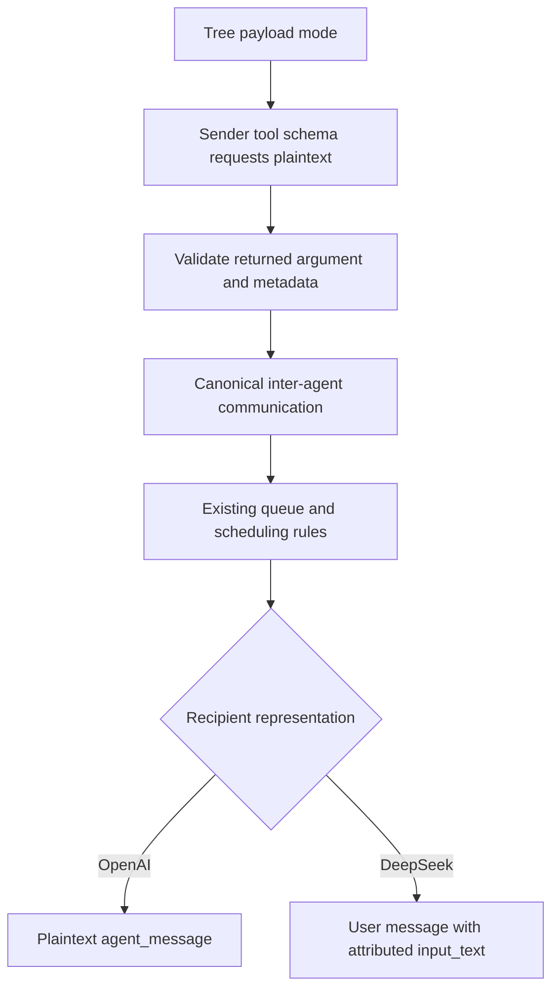

# Plaintext collaboration for mixed-provider MultiAgentV2

Status: implementation present; live OpenAI-to-DeepSeek qualification passed. The user approved implementation on 2026-09-18; regression and landing gates are tracked in [the validation record](plaintext-collaboration-validation.md).

Date: 2026-09-18. Source baseline: `9acb2d624c1d9070f787749d82b3fd598f7a61cb`.

## Objective

Allow an OpenAI parent to delegate work to a DeepSeek child, send messages and follow-up tasks, and receive the child's result. Preserve MultiAgentV2's existing addressing, scheduling, attribution, and lifecycle behavior.

The proposed solution is an explicit **plaintext collaboration mode**. It requests readable task arguments from the sender before generation, retains structured inter-agent communication internally, and renders messages according to the recipient's provider capabilities.

This is an application-level encoding change. HTTPS transport remains unchanged. Plaintext task content will be readable locally and may be stored in rollouts.

## Baseline behavior and evidence

At the source baseline, the implementation had four distinct steps:

1. The tool schemas for `spawn_agent`, `send_message`, and `followup_task` mark their `message` parameter with `.with_encrypted()` in [multi_agents_spec.rs](../../codex-rs/core/src/tools/handlers/multi_agents_spec.rs).
2. [ToolCall::direct_source](../../codex-rs/core/src/tools/router.rs) recognizes explicitly empty `encrypted_function_args` metadata as plaintext for particular collaboration calls. Missing metadata currently follows the ordinary direct-call path.
3. [agent_message_from_tool](../../codex-rs/core/src/tools/handlers/multi_agents_v2.rs) and [AgentMessage::into_communication](../../codex-rs/core/src/agent/control/delivery.rs) distinguish plaintext from encrypted arguments and construct an `InterAgentCommunication`.
4. [InterAgentCommunication::to_model_input_item](../../codex-rs/protocol/src/protocol.rs) emits an `agent_message` item for both forms. Making its content plaintext does not itself turn the item into an ordinary user message.

The [third-party patch](https://github.com/CCanxue/codex-deepseek-subagent-fix) changes delivery based on the sending turn's provider. That does not adequately handle an OpenAI sender and a DeepSeek recipient. It also cannot recover readable text from genuine OpenAI ciphertext merely by placing that ciphertext in `UserInput::Text`.

The recorded WSL2 run of the [provider matrix tests](../../codex-rs/core/src/tools/handlers/multi_agents_provider_delivery_tests.rs) produced:

| Parent | Child | Spawn | Send message | Follow-up |
| --- | --- | --- | --- | --- |
| OpenAI | OpenAI | Pass | Pass | Pass |
| OpenAI | DeepSeek | Fail | Fail | Fail |
| DeepSeek | OpenAI | Pass | Pass | Pass |
| DeepSeek | DeepSeek | Fail | Fail | Fail |

These were **handler-level diagnostic tests using synthetic text and omitted plaintext metadata**. All six failures occurred at the delivery assertion: the text was only in `encrypted_content`. They did not exercise real OpenAI ciphertext, the third-party patch, outgoing request serialization, or a live DeepSeek service.

Implementation revised these tests for the mode-aware contract below; all 12 plaintext cases passed. The baseline expectation that an OpenAI recipient receives an encrypted argument is not the expected behavior inside plaintext mode.

## Scope

The first implementation supports:

- Fresh MultiAgentV2 agent trees started in plaintext mode.
- All four OpenAI/DeepSeek provider combinations.
- Spawn, queue-only messages, follow-up tasks, and completion notifications.
- Cross-provider spawning with explicit `fork_turns="none"`.
- Resume and cold reload of threads created in this mode, with the mode preserved.

The first implementation does not decrypt opaque content, translate encrypted historical context, or support cross-provider history forks. It does not claim universal compatibility with every third-party Responses implementation.

## Proposed configuration and lifetime

Add a typed `task_payload` setting to the MultiAgentV2 configuration:

```toml
# Opt-in for the patched build; not available in the baseline checkout.
[features.multi_agent_v2]
enabled = true
task_payload = "plaintext"
```

The values are `encrypted` and `plaintext`, represented internally by an enum rather than a boolean. The default is `encrypted`, preserving the current OpenAI-only behavior.

Resolve this setting when the root thread starts. Every descendant inherits it, including children whose roles select another provider. A role must not silently change the tree's payload mode.

Persist the resolved mode in the thread's durable configuration/context metadata and restore it before creating tool schemas on resume or cold reload. Old rollouts without the field resolve to the legacy `encrypted` mode. A conflicting resume override must fail with an explanation to start a fresh tree; it must not reinterpret existing content.

The mode is fixed because the model chooses the recipient inside the tool call. Encryption of the `message` parameter has already been requested before Codex can inspect that chosen recipient. A fixed mode also keeps tool schemas stable between turns.

## Two independent decisions

### 1. Sender argument encoding

In plaintext mode, all three collaboration tool schemas omit the `encrypted` marker on `message`, including schemas advertised to an OpenAI parent. Function names, arguments, and result shapes remain unchanged.

Live qualification identified an additional backend constraint: `collaboration.spawn_agent` is a reserved schema on the tested OpenAI backend. Removing its encryption marker returns HTTP 400; retaining the marker succeeds and produces an opaque argument. The alternate namespace `collaboration_plaintext` accepts the unencrypted schema and produced the exact requested readable text with encryption metadata absent.

Therefore derive one effective namespace when building tools: plaintext mode maps the configured default `collaboration` to `collaboration_plaintext`; encrypted mode retains `collaboration`; other configured namespaces retain their names. The stored configuration remains unchanged. Apply this same effective namespace to schema registration, tool lookup, code-mode exposure, required child-management tools, and generated references. Advertise only one tool family, not both variants.

This is the design's previously deferred ordinary-tool fallback, activated by live backend evidence. It deliberately changes the effective namespace only for the new opt-in mode.

Normalize returned arguments using the resolved mode and the backend's argument metadata:

| Mode | Metadata for the message argument | Action |
| --- | --- | --- |
| Plaintext | Explicitly unencrypted | Accept as plaintext |
| Plaintext | Metadata absent | Accept under the advertised plaintext schema contract |
| Plaintext | Message explicitly marked encrypted | Reject before enqueueing or allocating a child |
| Encrypted | Existing supported metadata forms | Preserve the existing OpenAI behavior |

Do not guess whether a string is ciphertext from its appearance. In plaintext mode, accepting missing metadata relies on the provider honoring the advertised schema; this assumption requires live validation.

Use the logical tool identity and resolved mode for classification. Do not add another hardcoded dependency on the literal `collaboration` namespace: configurable namespaces and code-mode dispatch must receive the same treatment. Explicit encryption metadata must survive normalization long enough to enforce the rejection rule.

### 2. Recipient request representation

The receiving thread's resolved provider determines how a validated plaintext communication is represented on the wire:

| Sender | Recipient | Task argument in plaintext mode | Recipient input |
| --- | --- | --- | --- |
| OpenAI | OpenAI | Plaintext | Plaintext `agent_message` |
| OpenAI | DeepSeek | Plaintext | Ordinary user message with `input_text` |
| DeepSeek | OpenAI | Plaintext | Plaintext `agent_message` |
| DeepSeek | DeepSeek | Plaintext | Ordinary user message with `input_text` |

Introduce a small internal representation capability, such as `NativeAgentMessage` versus `UserMessage`. Initially OpenAI uses the former and non-OpenAI providers use the compatibility representation; DeepSeek is the required validated provider. Do not expose a provider-capability configuration framework in this first change.

Resolve the recipient after role overrides for spawning, and from the actual target thread for messaging. The request serializer belongs to that receiving thread, so it must not consult the sender's `turn.provider` to choose this representation.

Encrypted content directed at a recipient that cannot consume it is an error. The serializer must never relabel ciphertext as readable text or silently omit it.



## Keep delivery and scheduling separate

Retain the existing `InterAgentCommunication` operation and delivery pipeline. Convert its model-visible representation when constructing the recipient's request, rather than routing every message through `send_input`.

| Operation | Required behavior |
| --- | --- |
| `spawn_agent` | Validate mode, recipient, fork policy, and payload before creating the child; submit exactly one initial task |
| `send_message` | Queue exactly one message; do not wake an idle recipient; retain current delivery boundaries for an active recipient |
| `followup_task` | Start a turn if idle; deliver through the existing active-turn path otherwise; retain the prohibition on targeting the root |
| Completion notification | Preserve sender, recipient, result status, and existing wake-up behavior; render for the receiving parent's provider |

This preserves capacity checks, thread attribution, cancellation, and the distinction between a message and a new task. A successful queue operation must not be presented as proof that the receiving model has already processed it.

Completion delivery must be included explicitly. [The completion watcher](../../codex-rs/core/src/agent/control.rs) already creates plaintext inter-agent notifications, but those still require a compatible wire representation when the parent is non-OpenAI.

## History and model-visible context

Keep canonical history append-only. Plaintext inter-agent events retain their type and attribution in the rollout; ordinary user messages are a deterministic projection for a provider request, not a replacement of stored events.

The projection must:

- Preserve event order and include each message exactly once.
- Preserve task path, sender path, message kind, and content without duplicating the envelope.
- Produce stable, provider-valid identifiers across repeated requests; use a deterministic mapping if the provider cannot accept the canonical item ID.
- Leave ordinary user input, tool results, and unrelated context unchanged.
- Handle completion notifications through the same representation policy.
- Fail before sending a non-OpenAI request containing unsupported encrypted collaboration history.

Define any new model-visible wrapper as a struct in `core/context` implementing `ContextualUserFragment`. Reuse the attribution semantics of [InterAgentMessage](../../codex-rs/core/src/context/inter_agent_message.rs), but give the compatibility wrapper the required user role. Do not assemble a new context fragment as an ad hoc string in a tool handler.

An attributed agent message remains agent-supplied content even though its compatibility wire role is `user`. Preserve the existing instruction that subagent output is subordinate to system, developer, and actual user instructions. Test that attribution survives the conversion.

For the first version, cap a complete new plaintext collaboration fragment, including its envelope, at **4,096 UTF-8 bytes**. Reject oversized model-authored tasks before side effects, without silent truncation. Bound generated completion summaries using the existing truncation conventions and preserve the thread reference for retrieving more detail. Account for queued messages under the existing bounded context budget; delivery must not bypass that budget.

**P0 review gate:** these fragments can exceed 1,000 tokens. Repository rules require additional manual review of the context injection and limits before landing. The implementation must also verify the repository-wide 10,000-token per-item ceiling with its existing context accounting.

The mode and provider projection must remain stable for a thread. Use existing provider-change invalidation rules for request reuse; do not reset the client session for every message or reuse a provider-specific previous-response identifier with another provider.

## Forking and resume

For the initial release, require explicit `fork_turns="none"` whenever the resolved parent and child provider IDs differ. Reject full or partial history forks before child allocation. If omission resolves to a history fork, return the same actionable error rather than silently changing the requested fork behavior.

Provider IDs are a conservative boundary for this restriction, even if two configured IDs happen to point to the same endpoint. Proving cross-provider history portability is a separate feature.

Same-provider forks retain their existing policy, subject to the recipient's ability to consume the inherited history. In particular, a non-OpenAI request must reject any inherited opaque collaboration payload rather than losing it.

A thread started under the new mode can resume with the same persisted mode and compatible provider. Switching an old encrypted tree into plaintext mode is not a migration strategy. Start a fresh tree and provide a readable task or summary instead; retain the old rollout unchanged.

## Errors, diagnostics, and privacy

Use specific, model-facing errors for:

- An explicitly encrypted argument received under a plaintext schema.
- An unsupported encrypted payload or history item at the recipient boundary.
- A cross-provider history fork in the initial release.
- An oversized task or incompatible mode override on resume.

Validation should precede child allocation or enqueueing wherever the necessary information is available. Request construction provides a second check for resumed or historical content. Failure must not count a task as delivered or consume a permanent child slot.

Log operation kind, provider IDs, paths, payload mode, and failure category. Do not add plaintext task content to telemetry or debug logs. Extend existing plaintext argument redaction to the mode-aware path, including providers that omit argument metadata. In plaintext mode, redact outer code-mode `exec` programs in tracing and telemetry as well: they can contain a literal task before nested-call normalization runs. Preserve wrapper/cell attribution and ordinary rollout/UI content. Ordinary rollouts may contain plaintext under this explicit mode; it is not a promise of encrypted local storage.

## Implementation boundaries

Prefer small modules and existing abstractions over expanding central files.

| Concern | Proposed owner |
| --- | --- |
| Payload enum and TOML setting | Existing feature/config types, including `MultiAgentV2ConfigToml` and resolved `MultiAgentV2Config` |
| Recipient representation capability | Existing model-provider abstraction, with a narrow internal enum |
| Mode-aware tool schemas | `core/src/tools/handlers/multi_agents_spec.rs`, extracting shared schema policy if needed |
| Argument classification | Existing tool-call normalization plus a small collaboration-specific helper shared by dispatch paths |
| Admission and fork checks | Existing child-config and agent-control boundaries |
| Queueing and wake-up semantics | Existing agent-control delivery implementation |
| Context wrapper | A dedicated module under `core/src/context` |
| Deterministic wire projection | A small module invoked from request construction; avoid growing `core/src/client.rs` |
| Durable mode | Existing thread configuration/context persistence and resume paths |

No new RPC or duplicated tool family is proposed; plaintext mode uses the effective namespace described above. Persist the mode using existing config/context machinery where possible. If that requires a protocol field, define its compatibility and missing-field default explicitly and regenerate the affected fixtures.

## Validation and acceptance criteria

### Offline tests

1. **Schema tests:** all three tools omit `encrypted` in plaintext mode; encrypted mode preserves its schema. Verify the actual advertised request, including configurable namespaces and applicable dispatch modes.
2. **Argument tests:** exercise absent metadata, explicit plaintext, and explicit encryption. Ciphertext rejection must occur before a child or queued task is created.
3. **Provider matrix:** run all four provider pairs across spawn, message, and follow-up. Compare complete relevant payloads and attribution, not only whether a substring is present.
4. **Scheduling tests:** verify idle `send_message` does not initiate a request, follow-up wakes an idle child, active delivery does not start a duplicate turn, and a completion reaches the correct parent.
5. **Wire integration tests:** use mocked Responses servers and `TestCodexBuilder::build_with_auto_env()` to capture the recipient's outgoing request. A DeepSeek fixture must receive readable user `input_text`, with no collaboration `agent_message` or encrypted task payload. An OpenAI fixture must receive the intended native plaintext representation.
6. **Lifecycle tests:** cover persisted mode, cold reload, resume conflicts, fork rejection without leaked slots, unsupported encrypted history, stable ordering/IDs, and exactly-once projection across incremental requests.
7. **Bounds and logging tests:** cover oversize rejection, bounded completion summaries, context accounting, and plaintext redaction.

The existing 12 handler cases are diagnostic evidence, not sufficient acceptance coverage. Update them to select the proposed mode explicitly. Keep encrypted-mode regression coverage separate; do not force plaintext mode to reproduce the old encrypted expectations for OpenAI recipients.

### Live qualification

Before declaring OpenAI-to-DeepSeek support, verify that the effective tool schema yields readable OpenAI task arguments. The source-side probe passed on 2026-09-18 for `gpt-6-astra` under `collaboration_plaintext`; the reserved `collaboration` schema failed without its marker. This direct API probe establishes the source contract, not the complete patched Codex execution path.

Then perform an OpenAI parent to DeepSeek child exchange with a fresh child: an exact short spawn reply, a distinct follow-up reply, a queue-only message with observed non-waking behavior, and a completion returned to the parent. Record CLI commit, model/provider identifiers, schema mode, sanitized request shape, and results. Keep credentials and task bodies out of published diagnostics.

If the OpenAI backend still encrypts these arguments, stop qualification and investigate a separately named ordinary plaintext tool surface. Do not claim support by treating the returned ciphertext as text.

### Build and test environment

Use Ubuntu WSL2 on `windows-dev` through the `r-windev` workflow. The local machine was unable to sustain the Codex build comfortably.

The recorded diagnostic worktree is `/home/jlc/Codebase/codex-provider-matrix-9acb2d6`; logs and helper scripts are under `/home/jlc/Codebase/codex-matrix-payload`. Its build used Rust 1.95.0, eight Cargo jobs, and disabled debug symbols. Revalidate the revision and changed-file hashes before reusing it.

Run targeted tests with `just test`, never direct `cargo test`. After passing targeted checks, request approval before the complete workspace suite, as required by `AGENTS.md`. Regenerate `core/config.schema.json` for the config change and any affected protocol fixtures. Run scoped `just fix -p codex-core` for a large implementation and `just fmt` after testing; do not rerun tests after those cleanup steps under the repository's current instructions.

## Delivery stages

1. **Validate the plaintext source contract.** Prove the OpenAI schema behavior and capture the backend metadata forms. This is the prerequisite for the remaining work.
2. **Add mode configuration and persistence.** Establish defaults, tree inheritance, resume behavior, bounds, and mode-aware schema generation without enabling unsupported delivery.
3. **Add recipient projection and admission checks.** Preserve queueing, implement the context wrapper, handle completion notifications, and reject incompatible forks/history. Gate the configuration until this path is complete.
4. **Qualify and expose the feature.** Complete integration and live validation, review the P0 context gate, and document the delivered behavior and limits.

Keep each implementation change below the repository's normal review-size limits: under 500 changed lines for complex logic, and under 800 nonmechanical changed lines overall. Split by coherent dependencies; do not expose a working-looking plaintext option before its receiver path is usable.

## Alternatives considered

- **Check only the sender's provider:** rejected because it chooses the wrong transport for an OpenAI parent with a DeepSeek child.
- **Check only the recipient and rewrap the existing string:** insufficient because that string may already be ciphertext.
- **Flatten `encrypted_content` into `input_text`:** rejected as a decryption substitute. Changing a field name does not recover plaintext.
- **Send every communication through `send_input`:** rejected because it risks changing queue-only messages into turn-starting input.
- **Rewrite stored history for third-party providers:** rejected because it breaks append-only context and complicates replay and resume. Project requests deterministically instead.
- **Automatically switch mode when a non-OpenAI child is requested:** rejected because the sender has already generated that tool call under the earlier schema.
- **Advertise both encrypted and plaintext tool families:** rejected to avoid duplication. Live evidence required an alternate namespace, so plaintext mode substitutes one ordinary-tool namespace while preserving the existing function names.
- **Use MultiAgentV1 as the solution:** not selected because it does not establish the requested MultiAgentV2 scheduling, addressing, and compatibility behavior.

## Accepted implementation decisions

1. Use `task_payload`, an `encrypted` default, and a tree-wide immutable plaintext opt-in.
2. Require explicit `fork_turns="none"` for initial cross-provider support.
3. Enforce the 4,096-byte rendered-fragment cap, including bounded completion summaries. The additional P0 context review remains a landing gate.

The implementation request accepts these defaults. Completion of code changes, offline validation, and live end-to-end qualification must each be reported separately; a source-side API probe alone does not establish end-to-end support.
